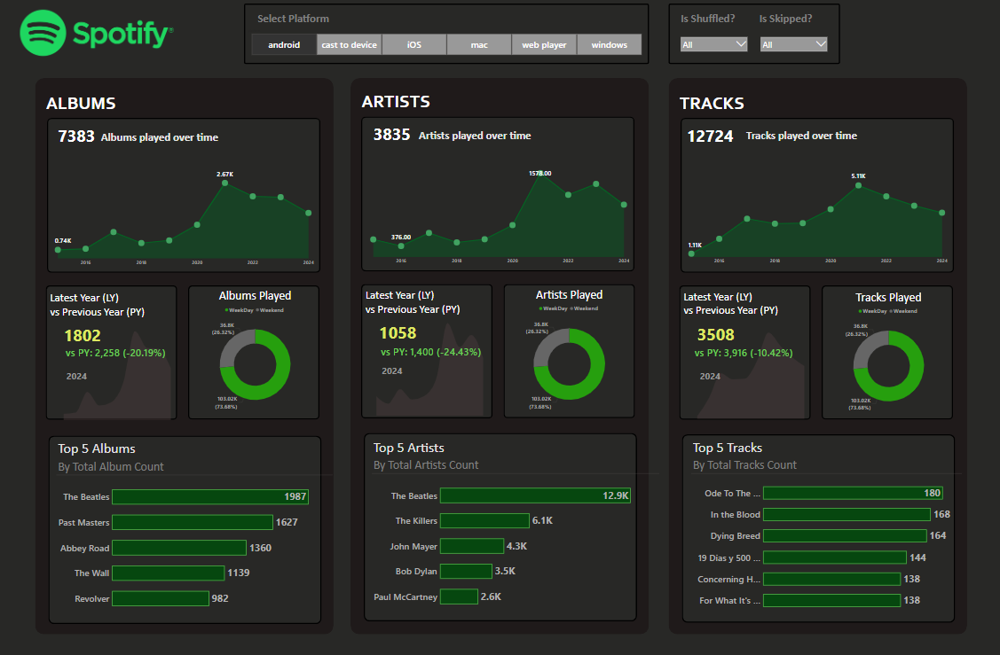
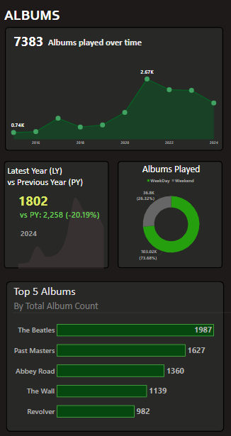
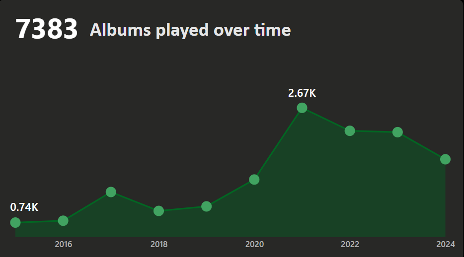
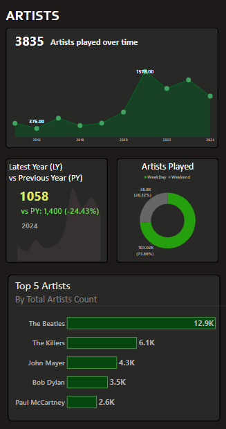
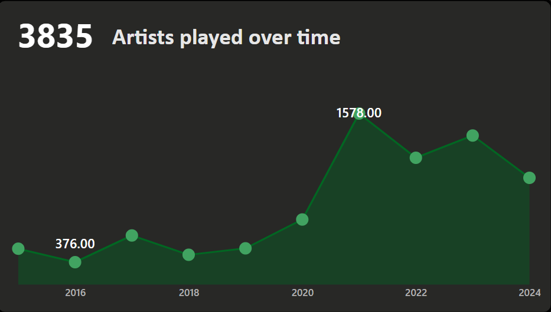
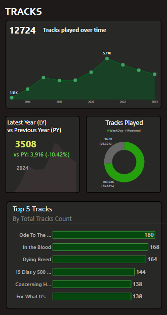
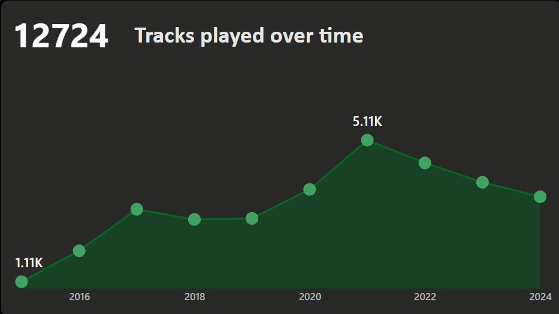
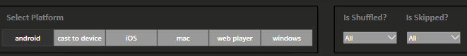
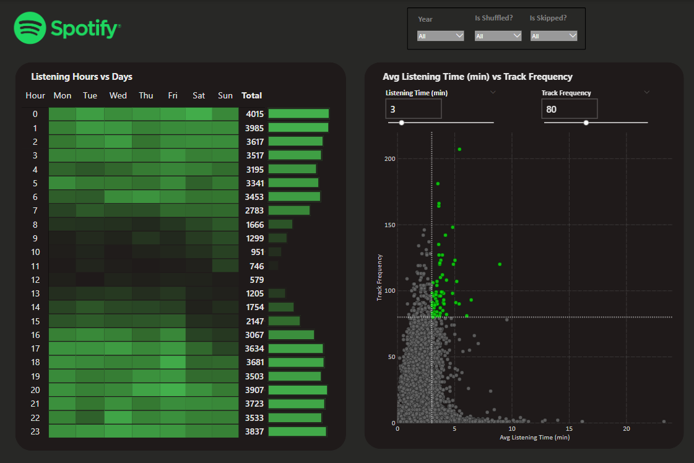
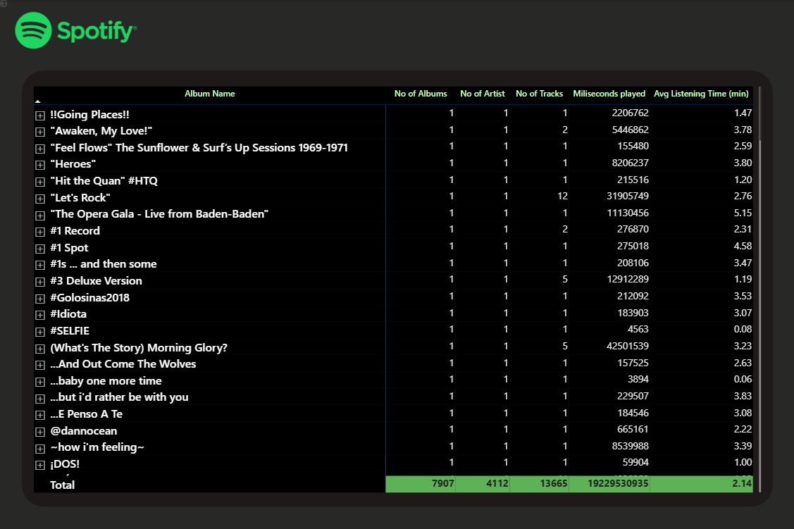

# 🚀 Power BI Dashboard: Spotify Listening Patterns & KPIs

This project presents an **interactive Power BI dashboard** designed to analyze Spotify listening behavior in depth. It showcases **top albums, artists, and tracks over time**, allowing comparisons between the **current and previous year** to observe trends and changes in listening preferences.

The dashboard also breaks down **weekday vs. weekend listening habits**, providing insight into how user engagement varies across different parts of the week. Additionally, it visualizes **listening activity by hour for each day**, from Sunday to Monday, helping to identify **peak listening hours** and patterns.

Overall, the dashboard provides valuable insights into user behavior and listening trends, enabling more informed content strategies, personalized recommendations, or simply deeper understanding of music consumption habits.

**Download my Spotify PowerBI Dashboard from here** - https://github.com/Gnikhil677/Power-BI---Spotify/blob/main/project%202.pbix

## 🎯 Project Objectives:

The primary objective of this project is to develop an interactive Power BI dashboard to analyze Spotify listening behavior and extract meaningful insights. Specifically, the dashboard aims to:

* **Analyze top albums, artists, and tracks over time**, identifying listening trends and preferences.
* **Compare the performance of top albums, artists, and tracks between the current and previous year**, highlighting changes in user behavior and new favorites.
* **Showcase the top 5 albums, artists, and tracks for the current year**, offering a quick view of the most popular content.
* **Break down listening activity by weekdays and weekends**, helping to understand when users are most active.
* **Visualize listening hours from Sunday to Monday across all days of the week**, in order to identify **daily peak listening hours** and optimize content timing or marketing efforts accordingly.

These objectives help transform raw listening data into actionable insights for music enthusiasts, analysts, managers or product teams looking to understand and enhance user engagement.

### 📄 Dataset Source

The dataset used for this Power BI dashboard project was sourced from the Data Tutorials YouTube channel. The project was developed with guidance provided in the channel’s tutorial, which served as a foundation for building the interactive sales and trends analysis dashboard.

### ✨ **Power BI Skills Utilized**

1. **Dashboard Designing**
   Designed a clean, interactive, and user-centric dashboard to visualize Spotify listening patterns. Focused on clarity, intuitive navigation, and responsive layout to deliver a seamless analytical experience for users exploring music data.

2. **Data Visualization (Charts & Graphs)**
   Leveraged diverse visual elements—including **bar charts, line graphs, KPI cards, slicers, and heat maps**—to display trends in top artists, albums, tracks, listening hours, and user engagement across weekdays and weekends.

3. **Power Query**
   Used Power Query to efficiently **clean, transform, and shape raw Spotify listening data**, including handling time-based data, extracting date components, and formatting timestamps for daily and hourly trend analysis.

4. **Power Pivot**
   Managed complex data modeling using Power Pivot by creating relationships between date, track, artist, and album tables—enabling dynamic filtering and deeper comparisons across time periods.

5. **DAX (Data Analysis Expressions)**
   Developed advanced DAX measures and calculated columns to:

   * Rank **top albums, artists, and tracks** for current and previous years
   * Calculate and compare **weekday vs. weekend listening durations**
   * Aggregate **hourly listening trends** for each day of the week
   * Compute **year-over-year performance metrics**

This project not only strengthened my technical proficiency in Power BI but also deepened my understanding of **time-based behavioral analytics** and **storytelling through data visualization**.

## 📊 Dashboad 1

The first dashboard in this project focuses on showcasing the most listened-to artists, albums, and tracks based on Spotify streaming data. It provides a clear snapshot of user preferences and music trends over time.

#### 💿 Albums

**Album Listening Trends and Analysis**

This section presents a detailed analysis of album listening behavior over time. The report includes year-over-year data showcasing the evolution of album plays, highlighting a **20% decrease in total plays compared to the previous year**.

A **donut chart visualizes the distribution of playtime between weekdays and weekends**, revealing that a significant majority of listening—approximately **74%—occurs on weekdays**. This suggests a preference for music consumption during routine or work-related days, possibly indicating music is used as a productivity aid or daily background activity.

Additionally, the report identifies the **top five most-played albums** during the analysis period:

1. *The Beatles*
2. *Past Masters*
3. *Abbey Road*
4. *The Wall*
5. *Revolver*

These selections reflect both classic rock influence and a continued engagement with iconic discographies.

Presented here is a line chart detailing album play activity over time, revealing the years that experienced the most significant and the least significant play volumes.

#### 🎸 Artists

**Artist Listening Trends and Analysis**

This section provides an in-depth overview of artist listening patterns over time. The analysis includes **year-over-year trends**, revealing a **25% decrease in total artist plays compared to the previous year**, indicating a potential shift in listening habits or a reduction in overall listening time.

A **donut chart illustrates the split between weekday and weekend listening**, with data showing that **approximately 74% of playtime occurs on weekdays**. This aligns with the album trend, suggesting that weekday listening plays a dominant role, possibly driven by daily routines or work-related listening preferences.

The analysis also highlights the **top five most-played artists** during the reporting period:

1. *The Beatles*
2. *The Killers*
3. *John Mayer*
4. *Bob Dylan*
5. *Paul McCartney*

These results underscore a blend of timeless classics and modern alternative rock influences, reflecting a diverse yet consistent musical taste.

This line chart visualizes annual artist play trends, clearly identifying the years with the highest and lowest play counts.

#### 🎶 Tracks

**Track Listening Trends and Analysis**

This section examines track-level listening trends across multiple years. The data presents a **year-over-year comparison**, revealing a **10.5% decline in total track plays compared to the previous year**. While the decrease is moderate, it may reflect evolving listening habits, playlist curation changes, or platform usage patterns.

A **donut chart breaks down the distribution of playtime between weekdays and weekends**, with findings indicating that **approximately 74% of listening occurs on weekdays**. This reinforces the trend observed across albums and artists, highlighting weekdays as the primary window for music consumption.

The analysis also identifies the **top six most-played tracks** during the period:

1. *Ode to the Mets*
2. *In the Blood*
3. *Dying Breed*
4. *19 Días y 500 Noches*
5. *Concerning Hobbits*
6. *For What It’s Worth*

These selections showcase a range of genres and emotional tones—from reflective indie rock and heartfelt singer-songwriter ballads to cinematic instrumentals—demonstrating a diverse and curated listening palette.

The accompanying line chart displays the annual distribution of track plays, with specific indicators for the years of maximum and minimum play.

### ⚙️ Filter Panel

**Filter Panel Overview**

The filter panel allows users to refine playback data by platform (e.g., Android, iOS, macOS, Windows, web player, or cast devices), as well as playback behavior such as whether tracks were **shuffled** or **skipped**. This enables targeted insights based on listening context and device usage patterns.

## 📊 **Dashboard 2: Listening Behavior Analysis**

This dashboard provides two key insights into listening habits:

* **Listening Hours vs Days**: A heatmap displaying listening activity distributed across each hour of the day and day of the week. The darker the shade, the higher the listening frequency, offering a clear view of peak listening periods. Notably, late-night and early morning hours show the highest engagement, with Sundays and Mondays being particularly active.

* **Average Listening Time vs Track Frequency**: An interactive scatter plot allowing users to explore track engagement patterns. Tracks are plotted by how often they are played (frequency) against their average listening time (in minutes).

  * **Sliders** enable dynamic filtering by minimum listening time and frequency, helping identify the most consistently played and attentively listened-to tracks (highlighted in green).

Together, these visualizations offer a granular view of when and how content is consumed, supporting deeper behavioral analysis and content strategy optimization.

## 📊 Dashboard Page - 3 : Details

This page presents a comprehensive tabular view of all tracks in the dataset, providing detailed metadata and listening metrics for each entry. The following attributes are included:

* **Track Name**
* **Artist Name**
* **Album Name**
* **Average Listening Time**
* **Total Milliseconds Played**

This granular view enables in-depth exploration of individual track performance, helping to identify listener engagement patterns, standout tracks, and potential areas for curation or recommendation strategies. It also serves as a valuable resource for filtering and segmenting content based on playback behavior and user interaction.

### 🧠 **What I Learned**

* **Advanced Data Analysis with Power BI**: Gained hands-on experience in building interactive dashboards, visualizing complex datasets, and deriving actionable insights using Power BI.

* **Efficiency in DAX Formulas**: Improved proficiency in writing optimized and accurate DAX expressions for calculated columns, measures, and dynamic visualizations.

* **Enhanced Dashboard Design Skills**: Developed a stronger sense of visual design, focusing on clarity, usability, and aesthetic presentation of data for diverse audiences.

## 💡 CONCLUSION

This project serves as a powerful analytical tool for **managers, artists, and music enthusiasts**, enabling them to **explore in-depth insights into the music industry**. With visualizations covering **top artists, albums, tracks, listening hours, and user behavior patterns**, the dashboard provides a comprehensive view of music consumption trends. These insights can support strategic decision-making, personalized content curation, and a deeper understanding of audience engagement.

On a personal level, this project significantly enhanced my **data analysis capabilities**, particularly in **Power BI**, where I gained efficiency in **DAX formulas**, improved my **dashboard design skills**, and strengthened my ability to transform raw data into meaningful, interactive insights.
